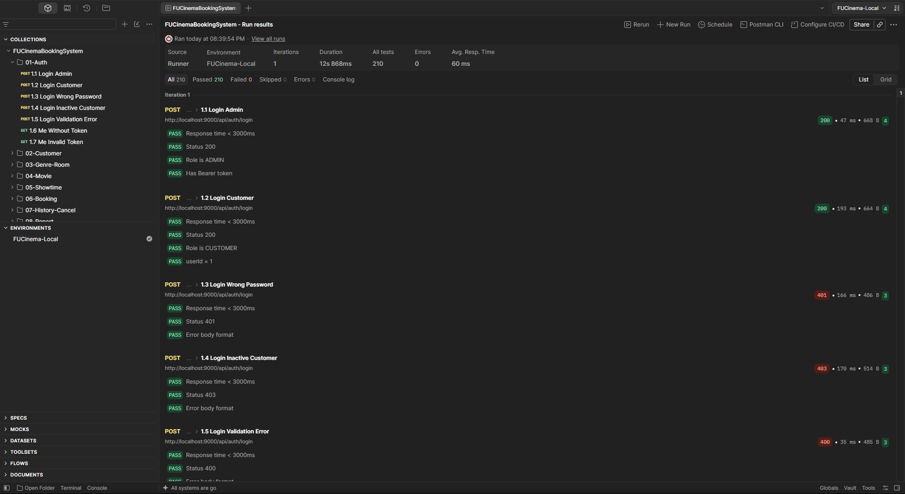

# FU Cinema Booking System

Hệ thống đặt vé xem phim theo kiến trúc microservices (MSS301 – Assignment 01).

## 1. Kiến trúc

| Ứng dụng | Cổng | Cơ sở dữ liệu | Ghi chú |
|---|---|---|---|
| `customer-service` | 8081 | SQL Server `cinema_customer` | Đăng ký, đăng nhập, cấp JWT |
| `movie-service` | 8082 | MongoDB `cinema_movie` | Phim, suất chiếu (tự seed lần đầu) |
| `booking-service` | 8083 | MySQL `cinema_booking` | Đặt vé, gọi `movie-service` qua OpenFeign |
| `api-gateway` | 9000 | – | Điểm vào duy nhất, kiểm tra JWT và phân quyền |

Hạ tầng DB chạy bằng `docker-compose.yml` (SQL Server 1433, MongoDB 27017, MySQL 3306).
**Luôn gọi API qua gateway `http://localhost:9000`**; gọi thẳng 8081/8083 sẽ báo `401 Missing user context header`.

## 2. Yêu cầu môi trường

- JDK 21
- Maven 3.9+ (hoặc dùng `mvnw` trong từng service)
- Docker Desktop, cấp tối thiểu 4 GB RAM (SQL Server cần >= 2 GB)
- Postman Desktop, hoặc Node.js (để chạy `newman` bằng `npx`)

## 3. Khởi động

Chạy tại thư mục `fu-cinema/`.

```bash
docker compose up -d
docker compose ps
```

Đợi `cinema-sqlserver` ở trạng thái `healthy` và `cinema-sqlserver-init` ở trạng thái `Exited (0)` (init xong DB `cinema_customer`). Sau đó khởi động lần lượt, mỗi service một terminal:

```bash
mvn -f customer-service/pom.xml spring-boot:run   # 1. :8081
mvn -f movie-service/pom.xml spring-boot:run      # 2. :8082
mvn -f booking-service/pom.xml spring-boot:run    # 3. :8083 (cần movie-service khi đặt vé)
mvn -f api-gateway/pom.xml spring-boot:run        # 4. :9000
```

Có thể thay bằng `./mvnw spring-boot:run` trong thư mục từng service.

Kiểm tra nhanh: `curl http://localhost:9000/api/movies` (public) trả về danh sách phim.

## 4. Tài khoản test

| Vai trò | Email | Password | Ghi chú |
|---|---|---|---|
| Admin | `admin@fucinema.com` | `@@abc123@@` | Lưu trong `application.properties` |
| Customer | `an@gmail.com` | `123456` | ID 1, ACTIVE |
| Customer | `binh@gmail.com` | `123456` | ID 2, ACTIVE |
| Customer | `chi@gmail.com` | `123456` | ID 3, **INACTIVE** (login trả 403) |

## 5. Kiểm thử bằng Postman

Thư mục `postman/` có 2 file:

- `FUCinemaBookingSystem.postman_collection.json`
- `FUCinema-Local.postman_environment.json`

**Postman Desktop:** Import cả 2 file, chọn environment `FUCinema-Local`, bấm **Run collection** (giữ nguyên thứ tự request).

**newman (dòng lệnh):**

```bash
npx -y newman run postman/FUCinemaBookingSystem.postman_collection.json \
  -e postman/FUCinema-Local.postman_environment.json
```

Collection chạy đúng trên **DB sạch** (vừa khởi động lần đầu). Kết quả mong đợi ở báo cáo thống kê (mục 8.1): `totalBookings = 2`, `totalTickets = 3`, `totalRevenue = 285000`.

Để chạy lại từ đầu: dừng 4 ứng dụng, rồi

```bash
docker compose down -v
rm -rf docker/          # PowerShell: Remove-Item -Recurse -Force docker
docker compose up -d
```

và khởi động lại các service theo mục 3.

## 6. Kết quả Collection Runner



> Ảnh được bổ sung sau khi chạy Collection Runner trên Postman Desktop.

## 7. Xử lý sự cố

- **Trùng cổng 3306 / 27017:** đã có MySQL / MongoDB khác đang chạy trên máy. Dừng container hoặc service đó (`docker stop mongodb`) rồi `docker compose up -d` lại.
- **Flyway báo checksum mismatch:** không sửa `V1__*.sql`, `V2__*.sql` sau khi đã chạy; cần đổi schema thì thêm file `V3__*.sql`. Nếu lỡ sửa, reset DB như mục 5.
- **`401 Missing user context header`:** đang gọi thẳng service. Gọi qua gateway cổng 9000.
- **`customer-service` không kết nối được SQL Server:** kiểm tra `cinema-sqlserver` đã `healthy` và `cinema-sqlserver-init` đã `Exited (0)`.
